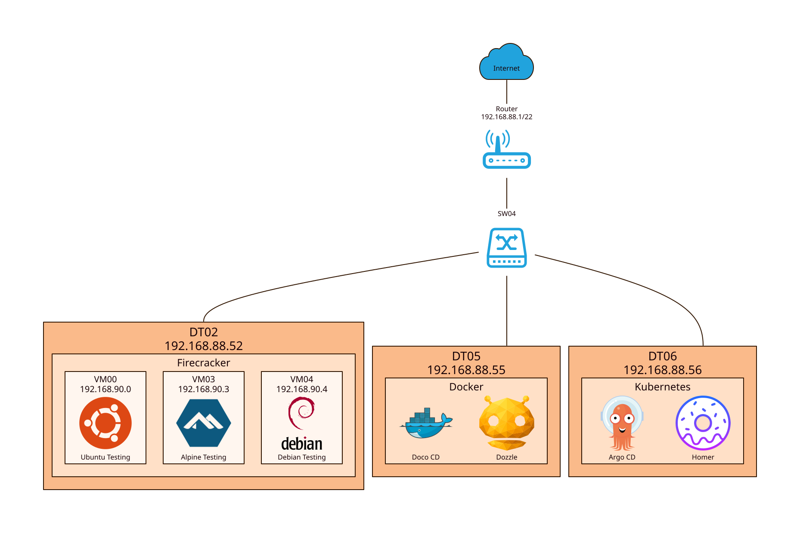

# Homelab Diagram

Diagram created with [D2](https://d2lang.com/)

Icons sourced from:
- [Terrastruct](https://icons.terrastruct.com/)
- [Dashboard Icons](https://dashboardicons.com/icons) 
- [VeryIcon](https://www.veryicon.com/)

Customisation by: [DƎEdItor](https://deeditor.com/)

## Styling choices

- Floating images for network components, with label `outside-top-center` and colour `#21a3dd`
- Rectangles for devices, with label `top-center`
- Images inside containers for services, with label `outside-bottom-center`
- Device names including IP address, separated by a newline
- Every device inside its own file, called by the parent object (or the diagram if it's physical hardware)

## To Do

- [ ] Git hook to render diagram on pre-commit
- [ ] Validation script to check styling